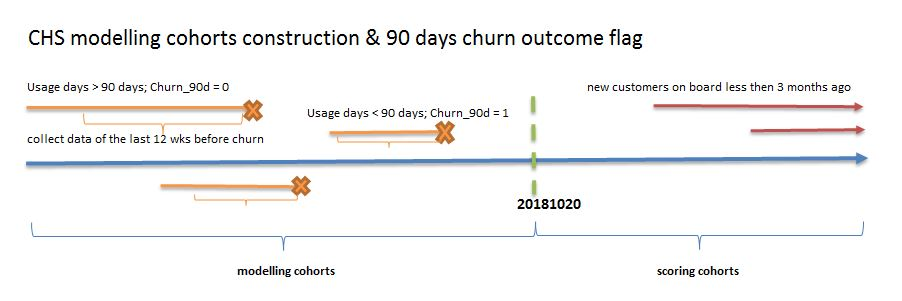

---
title: "Customer Happiness Score - churn model v1.3"
author: "David Qi"
date: Jan 2019
output: 
 html_document:
  css: custom_float.css
  toc: yes
  toc_depth: 6
---

```{r setup, include=FALSE}
knitr::opts_chunk$set(echo = TRUE)
options(width=200)
options(scipen=999) # Remove scientific notation
```

_This document is generated by Rmarkdown_  
_Stamp - `r date()`_  
_All rights reserved_  

<br>

## Project background

This model is the initial stage of EZtext customer happiness score modelling that predicts the likelihood of customers to churn in the first 90 days since initial usage. Other components of CHS modelling initiatives as followed are not included in this stage. 

1. If customer will churn after the first day usage (single day usage) ? 
2. Increasing/decreasing usage prediction (if customer remain active, will he/she increase or decrease his/her usage compared to the past?)
3. Product usage prediction (if customer remains active, how much usage will he/she consume in near future?)
4. Product xsell prediction (if customer remains active, how likely is he/she to take up additional products?)
5. Customer NPS prediction (will customers be more or less happier in near future? what drives that?)
6. Customer lifetime value

## Churn definition

* Survived 90 days: 0. Customers who have had onboarded since Jan 2017 and continued to use EZtext beyond the first 90 days.
* Churned in 90 days: 1. Customers who have had onboarded since Jan 2017 and churned within the first 90 days. 

## Cohorts split & outcome build



## Exclusions to development population

The following exclusions have been applied.

1. Customers who have had on boarded before Jan 2017. We use latest cohorts to reflect the current business p
2. System accounts. Accounts that link to a Callfire or Eztext email address. 

## Churn% Visualization 

### Churn% by industry

```{r, echo=FALSE, fig.width=16, fig.height=8}
# tran_rates <- mp$var_clean$tran[, .(tot=.N, res=sum(Response)), by=cohort][, Response_rate:=res/tot]
par(mfrow=c(1,2))
rates <- data[md_sc_f %in% c("md","sc"), .(tot=.N, res=sum(Response)), by=industry][, Response_rate:=res/tot][order(-Response_rate)]
with(rates, 
     {plot(x=1:length(industry), y=tot, type='l', ylim=c(0, 1.1*max(tot)), 
           col='blue', xaxt='n', xlab='', lwd=3, main=paste("Volume by Industry"))
       axis(side=1, at=1:length(industry), labels=as.character(industry), cex.axis=0.6, las=2)
     })
with(rates, 
     {plot(x=1:length(industry), y=Response_rate, type='l', ylim=c(0, 1.1*max(Response_rate)), 
           col='blue', xaxt='n', xlab='', lwd=3, main=paste("Churn% by Industry"))
       axis(side=1, at=1:length(industry), labels=as.character(industry), cex.axis=0.6, las=2)
})
```


## Data Sources

Customer segmentation DataMart that's stored at _bidw.customer-segmentation_. Feature engineering is performed to create more variables including the summaries on usage, dollar units, package logs, campaigns and number of recipients over a period of 12 weeks before the churn date or current reporting date. Trend variables all also added include 3 months trending up indicator and 3 months trending down indicator. 

## Train test split

The train/test data is split using _createDataPartition_ from _caret_ package based on 70%/30% ratio. 

## Variable classification

Classification detection is done to understand the raw variable characteristics and to classify the variables into the right groups. 

1. Label categorical and numeric variables based on variable format
2. Label non-predictive variables that's not to be used in modelling (e.g. account ID, email, phone numbers, etc.)
3. Label response variable and ID variables
4. Calculate the unique levels for both numeric and categorical variables
5. Delete variables that have only 1 unique value (constant value)
6. Convert numeric variables to categorical variables if variable has fewer than `r mp$auto_options$num_to_cat` unique levels
7. Delete categorical variables if variable has more than `r mp$auto_options$cat_to_del` unique levels
8. Output a variable volume summary

## Variable cleaning

A data cleaning process is conducted by the following steps. 

1. Calculate the training data variable missing percentage
2. Remove the variables that have missing values higher than `r percent(mp$auto_options$missing_perc)`
3. Calculate the medians for numeric variables
4. Impute the numeric variables missing values with calculated median
5. Label categorical missing values with explicit 'N/A'
6. Apply the same treatments in testing data using the calculated medians from training data
9. Output the summary of returned results including cleansed train and test data

## Data finalization

This step further refines the variables and prepares the datasets for modelling.


1. Test data detection and removes and out-of-scope entries
2. Single value variable detection by cohort that deletes constant value variables at any cohort
3. Output the processed train & test data and final lists of numeric and categorical variables


## Variable reduction

This step performs dimension reduction based on a IV (information value) cut-off `r mp$auto_options$var_reduct_iv_floor`.

1. Cut numeric variable into 10 percentiles, calculate variable IV against response
2. Calculate categorical variable IV against response based off nature grouping

IV is a numerical value which quantifies the predictive power of an independent continuous variable x in capturing the binary dependent variable y. The following benchmark values are typically used.

Information Value |	Variable Predictiveness
----------------- | -----------------------
Less than 0.02	  | Not useful for prediction
0.02 to 0.1	      | Weak predictive Power
0.1 to 0.3	      | Medium predictive Power
0.3 to 0.5	      | Strong predictive Power

For the total of `r length(mp$var_reduct$iv_sum$var)` variables, `r length(mp$var_reduct$iv_fail_vars)` are dropped due to IV below cut-off.
The full list of variables IV is attached in appendix. 

## Supervised learning

Two RandomForest (RF) models are built following the below strategy:

1. Build a raw randomForest model to output the variable importance.
2. Build a final randomForest model using the top `r mp$auto_options$rf_topNvars` variables only.

Model outputs and performance are shown below. 

### RF variable importance

```{r, echo=FALSE, fig.width=9, fig.height=7}
varImpPlot(mp$ml$randf$rft, main='RandomForest variable importance')
```

### Top variables

```{r, echo=FALSE}
knitr::kable(topvars)
```

### Top variables profiling by decile

The average value of the top variables by decide is shown below.

```{r, echo=FALSE}
datatable(topvarpfn, options = list(pageLength = 20)) %>% 
  formatRound('D1', 2) %>% 
  formatRound('D2', 2) %>% 
  formatRound('D3', 2) %>% 
  formatRound('D4', 2) %>% 
  formatRound('D5', 2) %>%
  formatRound('D6', 2) %>%
  formatRound('D7', 2) %>% 
  formatRound('D8', 2)
  # formatRound('D9', 2)
```

### RF final model Gini

The model displays stable ranking power across model train and test sets. 

```{r, echo=FALSE}
# datatable(mp$ml$randf$rf_Gini, options=list(dom='t', pageLength=20))
knitr::kable(data.frame(mp$ml$randf$rf_Gini), digits=2) 
```

<!-- ```{r gini_plot, echo=FALSE} -->
<!-- with(mp$ml$randf$rf_Gini,  -->
<!--      {plot(x=1:length(cohort), y=RF_GINI, type='l', ylim=c(0, 1.1*max(RF_GINI)),  -->
<!--            col='blue', xaxt='n', xlab='', lwd=3, main=paste("RandomForest Gini by train and test")) -->
<!--       axis(side=1, at=1:length(cohort), labels=as.character(cohort)) -->
<!--       abline(v=length(mp$auto_options$tran_cohorts)+0.5,lty=3) -->
<!--     }) -->
<!-- ``` -->

### RF model calibration

A calibration is in place to adjust the raw model scores back to the actual take-up probability level. The following method is used. 

A logistic regression model is built on the actual responses and the predicted model scores (using test sets). The output predictions from logistic model are then used as actual propensity scores. 

The following graphs show the before and after calibration comparison.  

```{r, echo=FALSE, fig.width=12, fig.height=9}
plot(mp$ml$randf$rf_calmPlot)
```

### RF Conversion% - 10 Deciles

A 10-decile conversion% is based on the final model scores on the entire test set.  

```{r, echo=FALSE}
datatable(mp$ml$randf$rf_testDecile, options=list(dom='t')) %>% 
  formatPercentage('Convertion',2)
```

### RF Conversion% - OptimalBinning

Rather than a 10-decile view, a decision tree model is built to find the optimal score cut-offs to reach the highest distinction across groups. 

<br>
Test set 

```{r, echo=FALSE}
datatable(mp$ml$randf$rf_testOptBin$ivtable, options=list(dom='t')) %>% 
  formatPercentage('GoodRate',2) %>% 
  formatPercentage('BadRate',2)
```

<br>
Test set

```{r, echo=FALSE}
datatable(mp$ml$randf$rf_testOptBin_Last$ivtable, options=list(dom='t')) %>% 
  formatPercentage('GoodRate',2) %>% 
  formatPercentage('BadRate',2)
```

### Model performance

Calculate confusionMatrix on test set, using varying threshold to simulate performance. Blue for non-churn predictions accuracy and red for churn predictions. 

```{r, echo=FALSE}
with(confsim, {
  plot(y=Non_churn_accuracy, x=Threshold, type='l', col='blue', ylim=c(0.6, 0.9), lwd=2, 
       main="Accuracy similation with varing score threshold")
  lines(y=Churn_accuracy, x=Threshold, type='l', col='red', ylim=c(0.6, 0.9), lwd=2)
  abline(v=0.41,lty=2)
})
```

The threshold 41% achieves decent accuracy on both groups with reasonable volumes. However, this model does not return a binary outcome at all, rather, returns the granular propensity score as the churn likelihood. It is not recommended that users use a particular cut-off. This should depend on the campaign requirement. 

```{r, echo=F}
confoptim = InformationValue::confusionMatrix(conf[,2], conf[,1], threshold=0.41)
rownames(confoptim) = paste('Predicted -', c('0','1'))
colnames(confoptim) = paste('Actual -', c('0','1'))
confoptim$accuracy = c(round(confoptim[1,1]/sum(confoptim[1,]),2), round(confoptim[2,2]/sum(confoptim[2,]),2))
confoptim
```

### Prediction score distribution

```{r, echo=FALSE}
mp$ml$resullt$test %>% 
  ggplot(aes(x=RF_Cscore)) +
  geom_density(fill=I("red"), alpha=.3) +
  ggtitle("Score distribution using test data")
```

## Further improvements

1. Classify high/low value cities/states into groups
2. Derive industries from company names (done)
3. Identify the main reasons for user campaigns. e.g. sales, promotion, events, notice, religious, communication, election, etc. (done)
4. Incoming messages analytics. e.g. customer sentiment analysis, response rate, unsubscribes, etc.
5. Key words usage (partially done)
6. Plan purchase history/migrations 
7. Keep/remove 'life time' related variables from modelling population. (done)
8. Churn 1 day predictive model. (no longer required at this stage)

## Appendix

### Automation options

```{r, echo=FALSE}
knitr::kable(x=data.frame(unlist(mp$auto_options)))
```

### Data profiling

```{r, echo=FALSE}
knitr::kable(mp$final_set$trandesc, digits=2)
```

### IV scores

The following benchmark values are typically used for variable predictive power. 

Information Value |	Variable Predictiveness
----------------- | -----------------------
Less than 0.02	  | Not useful for prediction
0.02 to 0.1	      | Weak predictive Power
0.1 to 0.3	      | Medium predictive Power
0.3 to 0.5	      | Strong predictive Power

```{r, echo=FALSE}
knitr::kable(arrange(mp$var_reduct$iv_sum, -iv), digits=2)
```


